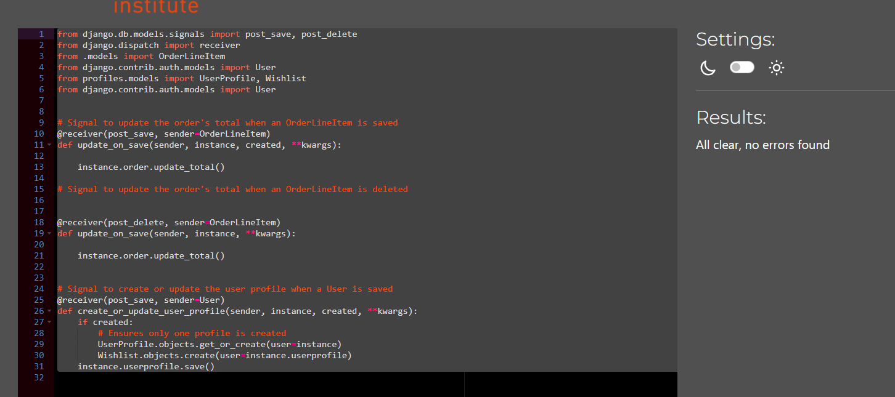

Welcome to Confident Smile, the go-to online store built with the Django web framework, specializing in organic and fluoride-free teeth whitening products. Designed for health-conscious consumers, eco-friendly shoppers, individuals with sensitivities to fluoride, and tech-savvy enthusiasts who appreciate a user-friendly platform, our offerings cater to those looking for natural, environmentally friendly dental care solutions.

## **[Live site](https://confident-smile-9920989d7786.herokuapp.com/)    |    [Repository](https://github.com/assofiejakobsson/confident-smile.git)**

## Table of Contents
- [**Live site    |    Repository**](#live-site--------repository)
- [Table of Contents](#table-of-contents)
- [User Experience (UX)](#user-experience-ux)
  - [User Stories](#user-stories)
    - [EPIC | Product details and information](#epic--product-details-and-information)
    - [EPIC | Shopping cart and chckout](#epic--shopping-cart-and-chckout)
    - [EPIC | Order management and analytics](#epic--order-management-and-analytics)
    - [EPIC | Order management and analytics](#epic--order-management-and-analytics-1)
    - [EPIC | Product management](#epic--product-management)
    - [Epic: Customer suport and marketing](#epic-customer-suport-and-marketing)
    - [EPIC | Order management and analytics](#epic--order-management-and-analytics-2)
    - [Epic: Customer suport and marketing](#epic-customer-suport-and-marketing-1)
    - [Colour Scheme](#colour-scheme)
- [Wireframes](#wireframes)
- [Agile Methodology](#agile-methodology)
- [Security Features and Defensive Design](#security-features-and-defensive-design)
  - [User Authentication](#user-authentication)
  - [Database Security](#database-security)
- [Testing](#testing)
- [Validator Testing](#validator-testing)
  - [HTML](#html)
  - [CSS](#css)
  - [Javascript](#javascript)
  - [Python](#python)
  - [Lighthouse](#lighthouse)
- [Browser Testing](#browser-testing)
- [Device Testing](#device-testing)
- [Bugs](#bugs)
- [Deploy the App to Heroku](#deploy-the-app-to-heroku)
- [Languages](#languages)
- [Credits](#credits)

## User Experience (UX)

The typical visitor to this webshop is an individual who is both health- and environmentally-conscious, actively seeking quality products that reflect these values, and is willing to invest in organic and fluoride-free teeth whitening solutions to maintain a healthy and radiant smile.

### User Stories

#### EPIC | Product details and information
- As a customer, I want to view a variety of teeth whitening products that are organic and fluoride-free, so I can choose the one that best suits my needs.
- As a customer, I want to view detailed product descriptions, including ingredients, benefits, and usage instructions, to make an informed decision before purchasing.
- As an administrator, I want to manage product inventory, including adding new products, updating product details, and removing discontinued items.

#### EPIC | Shopping cart and chckout
- As a customer, I want to create an account, which allows me to save my shipping addresses, track previous orders, and easily make future purchases.
- As an administrator, I want to manage product inventory, including adding new products, updating product details, and removing discontinued items.
- As a customer, I want to securely proceed to checkout and provide shipping and payment information to complete my purchase. 
- As a customer, I want to receive confirmation emails with order details and shipment tracking information after making a purchase.
- 

#### EPIC | Order management and analytics
 - As a customer, I want to add products to my cart and have the ability to adjust the quantities or remove items if needed.
 - As an administrator, I want to track and manage customer orders, including order fulfillment, shipping, and cancellations if necessary. 

#### EPIC | Order management and analytics
 - As a customer, I want to search for specific teeth whitening products by name, category, or specific features.
 - As an administrator, I want to have access to an admin panel where I can manage user accounts, and oversee overall website functionality

#### EPIC | Product management 
 - As a customer, I want to search for specific teeth whitening products by name, category, or specific features. 
 - As a customer, I want to read reviews and ratings from other customers to help me make a more informed decision about a particular product.

####  Epic: Customer suport and marketing 
 - As a customer, I want to receive promotional offers or discounts via email newsletters, providing me with incentives to make repeat purchases.

The following user stories where labelled as "could have" and "Won't Have" on my project board on Github.

#### EPIC | Order management and analytics
 - As a customer, I want to search for specific teeth whitening products by name, category, or specific features.
 - As an administrator, I want to generate sales reports and analytics to monitor the performance of the teeth whitening products and identify areas for improvement or marketing strategies. 

####  Epic: Customer suport and marketing 
- As a customer, I want to have access to a customer support contact or live chat feature to ask questions or get assistance with product selection or any issues I encounter.

#### Colour Scheme
<small><i><a href='https://coolors.co/ffffff-000000-98dff6-5fcafb-1ab2ff-0096ff-4176f8'>Colour palette from Coolors</a></i></small>

The colour scheme of the site is mainly linear-gradient. The rest is boostrap.

The colors are designed with ease of use in mind. 

## Wireframes

 
Login Page

## Agile Methodology

Github projects was used to manage the development process using an agile approach. The link to my project board is [here.](https://github.com/users/assofiejakobsson/projects/28)

## Security Features and Defensive Design

### User Authentication

User Authentication

Users are securely verified when they sign up and log in.
User passwords are safely stored in a coded format to keep them secure.
Users can log in using their social media accounts safely.
Secure Form Submissions

Protection against unauthorized form submissions is in place.
Password Reset

A secure process is used for resetting passwords.
Custom User Data

User information is kept secure with a customized system.
Encrypted Communication

Data transmission is encrypted to protect user information.
Regular Updates

Frequent updates maintain security and stability.
Security Checks

Regular audits ensure adherence to the latest security standards.
Responsible Reporting

Encouraging responsible reporting of vulnerabilities for timely resolution.
CSRF Protection and Object Retrieval:

The CSRF tokens and middleware are built-in Django mechanisms to handle CSRF protection and mitigate the risks associated with CSRF attacks.
The 'get_object_or_404' function is used to handle object retrieval from the database. This function retrieves an object but raises a 404 HTTP response if the object is not found. This helps avoid exposing sensitive information or potential security vulnerabilities.

### Database Security

 - The database url and secret key are stored in the env.py file to prevent unwanted connections to the database.

## Testing

## Validator Testing

### HTML 

The web app was Validate by URI [W3C HTML Validator](https://validator.w3.org/). And it was no errors or warnings. See the images below.

Html

### CSS

The web app was Validate by URI [W3C CSS Validator](https://jigsaw.w3.org/css-validator/) And it was no errors or warnings. See the images below.

Css

### Javascript

No errors were found, but One undefined variable "$". it belongsnd  jQuery library. [Jshint](https://jshint.com/) 

Jshint

### Python

7 Five warnings which seems to have with which version I have and the redden seems to be from the fact that they are baked into my django code

CI Python Linter

### Lighthouse

Lighthouse validation was run on all pages (both mobile and desktop) in order to check accessibility, performance, Best Practices and SEO. At first I received issues for my lables for name. And this is the result after I fixed it.

## Browser Testing
- I have tested the web app on Google Chrome, Firefox, Safari and Edge browsers without more problems than I already recorded. .

## Device Testing
- The web app was viewed on a variety of devices such as Laptop, iPad, samsung s21, s9, zflip 4 and motorola g8 plus. to ensure responsiveness on various screen sizes and bugs. Its responsive.

## Bugs 

I am receiving this error message when I try to edit the account pages for login, log out, and register. I have sought help from a tutor, but they have not seen this before, so there's a risk of damaging many other things. They believe that the problem might be due to having the 'code anywhere' template in Gitpod. The accounts are working, but they lack CSS and a cancel button.

I also have a bug in the order history, as it is only visible on the admin page and not on the profile page as it should be. I don't know why, as I haven't had a chance to look into it yet.

My favicon is not showing, and that's because I uploaded it as a zip file in my bucket on Amazon. I haven't had a chance to fix this yet.

I am also missing some CSS due to a lack of time, so it's not a bug

## Deploy the App to Heroku

To deploy your app to Heroku, follow these steps:

 ##Create a new external database.
 - Log in to your ElephantSQL account.
 - Copy the DATABASE_URL located in Config Vars in the Settings Tab.
 - Click "Create New Instance" and follow the steps outlined in the instructions.
 - Copy the ElephantSQL database URL.

##Create the Heroku App.
 - Log in to Heroku or create a new account if you don't have one.
 - On the main page, click the "New" button in the top right corner and select "Create New App" from the drop-down menu.
 - Choose a unique and meaningful app name.
 - Select the region that is closest to your target audience.
 - Click on the "Create App" button.
 - Open the settings tab and click "Reveal Config Vars."
 - Add a config var called DATABASE_URL and paste the ElephantSQL database URL as the value.

##Prepare the environment and settings.py file
 - In your local development environment, create an env.py file in the main directory of your project.
 - Add the DATABASE_URL value and your chosen SECRET_KEY value to the env.py file.
 - Update the settings.py file to import the env.py file and configure the SECRET_KEY and DATABASE_URL.
 - Comment out the default database configuration in the settings.py file.
 - Save the files and run the necessary migrations.
 - Configure the STATIC files settings using Amazon for static and media files, including the URL, storage path, directory path, root - - path, media URL, and default file storage path.
 - Link the file to the templates directory in Heroku.
 - Change the templates directory variable to TEMPLATES_DIR.
 - Add the Heroku app URL to the ALLOWED_HOSTS list, using the format ['app_name.heroku.com', 'localhost'].
 - Create files/directories:
 - Create requirements.txt file.
 - Create three directories in the main directory; assets, static, and templates.
 - Create a file named "Procfile" in the main directory and add the following: web: gunicorn ConfidentSmile.wsgi.
 - Update Heroku Config Vars:

##Add the following Config Vars in Heroku,

 - SECRET_KEY value.
 - Amazon configuration for handling static and media files.
 - PORT = 8000.

##Deploy,
 - Make sure that the DEBUG setting in your Django settings is set to False.
 - In the Heroku Dashboard, go to the "Deploy" tab of your app.
 - Connect your app to your GitHub repository by selecting the repository and branch.
 - Scroll down to the deployment options and choose whether to enable automatic deploys or deploy manually by clicking the "Deploy Branch" button.
 - Wait for the deployment process to complete.
 - Click View to view the deployed site.
 - The site is now live.

##Forking this repository,
 - Locate the repository at this link Confident Smile.
 - At the top of the repository, on the right side of the page, select "Fork" from the buttons available.
 - A copy of the repository is now created.

##Cloning this repository

 - To clone this repository, follow the below steps,
 - Go to the repository at this link Confident Smile.
 - Under the "Code" button, select your preferred cloning option (HTTPS, SSH, or GitHub CLI) and copy the provided URL.
 - Open your Terminal or command-line interface.
 - Navigate to the directory where you want to clone the repository.
 - Type git clone and then paste the URL you copied from GitHub.
 - Press "Enter" to create the local clone of the repository.

## Languages

- Python
- HTML
- CSS
- Javascript

## Credits

- images to the shop are taken frome amazone.
- This repository was created using the template provided by Code Institute. [Code Institute Template](https://github.com/Code-Institute-Org/ci-full-template)
- To get the Django framework installed and set up I followed the Code institutes [Boutique Ado](https://learn.codeinstitute.net/courses/course-v1:CodeInstitute+EA101+2021_T1/courseware/eb05f06e62c64ac89823cc956fcd8191/40cc2543c48643fda09351da6fa90579/)
- My starting code I get from [Boutique Ado](https://learn.codeinstitute.net/ci_program/diplomainsoftwaredevelopmentecomm)from Code Institut.
- I have received a lot of help from tutors at Code Institute.
- I have had a lot of help from this page when trying to understand what to do and why.[w3schools](https://www.w3schools.com/django/index.php)
- I have used this to create my favicon.[favicon](https://favicon.io/favicon-generator/)
- For my background i have used a gardient and I created that here. [gardient](https://mycolor.space/gradient?ori=to+bottom&hex=%23401EDB&hex2=%231282EB&sub=1)

[Back to Table of contents](#table-of-contents)

